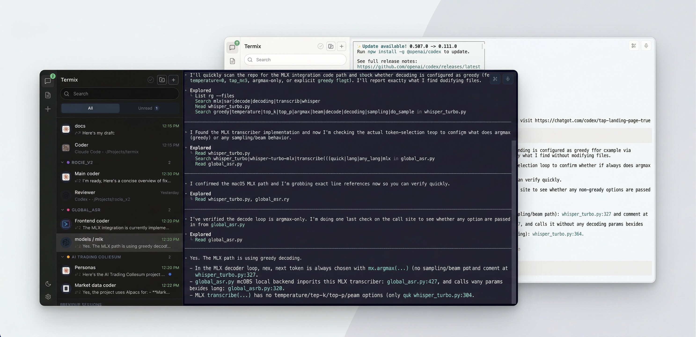

# clideck

> **Formerly `termix-cli`** — if you arrived here from an old link, you're in the right place. The project has been renamed to **CliDeck**. Update your install: `npm install -g clideck`

Manage your AI agents like WhatsApp chats.

[Documentation](https://docs.clideck.dev/) | [Video Demo](https://youtu.be/hICrtjGAeDk) | [Website](https://clideck.dev/)



You run Claude Code, Codex, Gemini CLI in separate terminals. You alt-tab between them, forget which one finished, lose sessions when you close the lid.

clideck puts all your agents in one screen — a sidebar with every session, live status, last message preview, and timestamps. Click a session, you're in its terminal. Exactly like switching between chats.

Native terminals. Your keystrokes go straight to the agent, nothing in between. clideck never reads your prompts or output.

## Quick Start

```bash
npx clideck
```

Open [http://localhost:4000](http://localhost:4000). Click **+**, pick an agent, start working.

Or install globally:

```bash
npm install -g clideck
clideck
```

## What You Get

- **Live working/idle status** — see which agent is thinking and which is waiting for you, without checking each terminal
- **Session resume** — close clideck, reopen it tomorrow, pick up where you left off
- **Notifications** — browser and sound alerts when an agent finishes or needs input
- **Message previews** — latest output from each agent, right in the sidebar
- **Projects** — group sessions by project with drag-and-drop
- **Search** — find any session by name or scroll back through transcript content
- **Prompt Library** — save reusable prompts, type `//` in any terminal to paste them
- **Plugins** — ships with Voice Input and Trim Clip, or build your own
- **15 themes** — dark and light, plus custom theme support

## Mobile Access

Check on your agents from your phone. Start a task, walk away, glance at your phone — see who's done, who's working, who needs input. Pair with one QR scan, no account needed. E2E encrypted — the relay cannot read your code.

## Supported Agents

clideck auto-detects whether each agent is working or idle:

| Agent | Status detection | Setup |
|-------|-----------------|-------|
| **Claude Code** | Automatic | Nothing to configure |
| **Codex** | Automatic | One-click setup in clideck |
| **Gemini CLI** | Automatic | One-click setup in clideck |
| **OpenCode** | Via plugin bridge | One-click setup in clideck |
| **Shell** | I/O activity only | None |

Claude Code works out of the box. Other agents need a one-time setup that clideck walks you through.

## How It Works

Each agent runs in a real terminal (PTY) on your machine. clideck receives lightweight status signals via OpenTelemetry — it knows *that* an agent is working, not *what* it's working on.

Everything runs locally. No data is collected, transmitted, or stored outside your machine.

## Platform Support

Tested on **macOS** and **Windows**. Works in any modern browser. Linux: untested — if you try it, open an issue.

## Documentation

Full setup guides, agent configuration, and plugin development:

**[docs.clideck.dev](https://docs.clideck.dev/)**

## Acknowledgments

Built with [xterm.js](https://xtermjs.org/).

## License

MIT — see [LICENSE](LICENSE).
