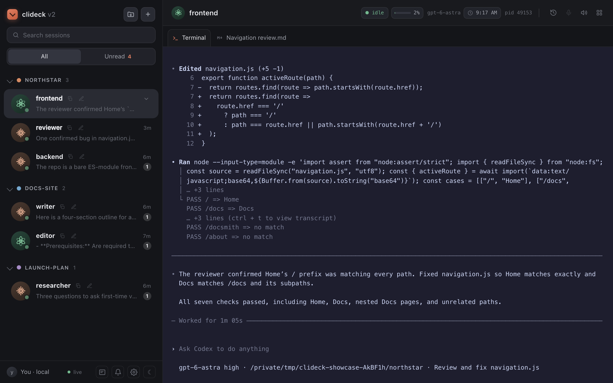
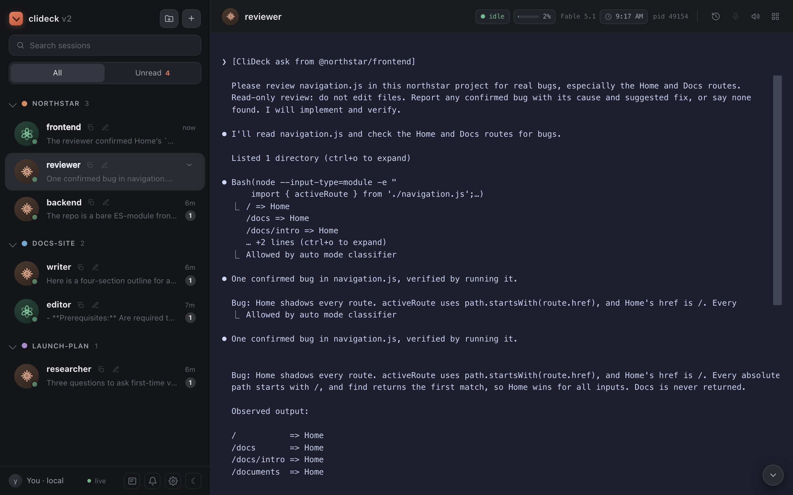
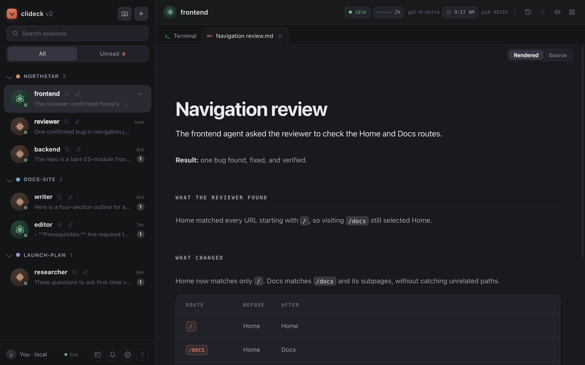

# clideck

One place for your AI agents to work with you and each other.



*Three projects, six sessions, and a Codex agent working with a Claude Code reviewer.*

Put a frontend agent, a backend agent, and a researcher in the same project. They can
use different AI providers. Tell one to ask another for help, and the request and
answer travel between their actual terminals. You stay part of the conversation.

CliDeck runs the agent CLIs you already use. No orchestration code to write, and no
new agent API to wire up.

## Quick start

Requires **Node.js 22.12 or newer** and at least one installed agent CLI.

```sh
npm install -g clideck@2
clideck
```

Open **http://127.0.0.1:4000**. Create a project, open a few sessions, and give them
names that describe their work. The short tour shows you around.

You can also run `npx clideck@2`. Coming from v1? Read [the upgrade notes](UPGRADING.md)
first. The latest v2 imports your legacy sessions, projects, and saved prompts automatically.

## Agents working together

You lead the project: set the direction, try the results, and give feedback.
Your agents use **CliDeck Ask** to bring in teammates and work through that
feedback together, even when they use different AI providers. For example:

**Building an FPS game**

1. You tell the character programmer: “Some enemy voices feel out of place.
   They should sound rougher and fit the game's atmosphere.”
2. The programmer uses CliDeck Ask to explain what needs to change to the sound
   agent, who uses its audio tools to create new voices and effects.
3. The sound agent sends back the new files. The programmer adds them to the
   game, and you play it again and decide what still needs work.

**Training an image LoRA**

1. You tell the training manager: “The results look good in daylight, but faces
   look wrong in darker scenes.”
2. The training manager uses CliDeck Ask to work with the dataset agent on
   finding and curating more suitable low-light examples.
3. The dataset agent returns the updated dataset. The training manager runs
   another training round and brings you comparison images to review.



*A real Ask exchange: Codex requests a review from Claude Code in another session,
then uses the reply to fix the issue.*

- **Projects** keep sessions together around a folder.
- **Session names are addresses** such as `@website/reviewer`. Type `@@` in a
  terminal to find them.
- **CliDeck Ask** carries requests and replies between sessions. Agents can check
  who is available or steer a session that is already working.
- **You stay involved** through the terminals, notifications, and questions agents
  can send back to you.

The agent-facing commands are available inside CliDeck sessions:

```sh
clideck agents
clideck ask "@website/reviewer" "Review the changes and report the important issues"
clideck ask status
```

## View what they produce

Ask an agent to show its work inside CliDeck. Markdown reports, HTML pages, images,
videos, PDFs, diagrams, and diffs open in preview tabs beside the terminals. You can
also drop files onto the tab strip.



*The same review, summarized as a document you can read inside CliDeck.*

```sh
clideck show report.md
clideck show demo.html
clideck show walkthrough.mp4
```

## Also included

- Claude Code, Codex, Gemini, OpenCode, Pi, and shell sessions, plus custom commands.
- Saved prompts with `//` lookup and `{{session_name}}` / `{{project_name}}` fields.
- Session resume, terminal history, working/idle notifications, and session backups.
- Light and dark themes, configurable shortcuts, and a plugin SDK.
- **Git Changes** shows what your agents changed, with branch and worktree comparisons.
- **Supertonic Voice** reads replies and selected text aloud.
- **Emoji** support and optional **Smart Dictation** for speaking your prompts.

Voice models are downloaded when set up; they are not included in the npm package.
OmniVoice is not part of this release.

## What changed in v2

We removed Autopilot because today's agents already have sub-agents. The CLI is
the right interface for this generation of CLI agents, so CliDeck focuses on
helping them work across providers with you.

We also removed mobile control. Harnesses such as Codex and Claude Code now provide
their own remote access, and maintaining another mobile control layer no longer
makes sense for CliDeck.

The focus is projects where you and agents from multiple providers work together,
with their conversations and outputs in one place.

## Running locally

```sh
clideck --port 4200
clideck --data-dir /path/to/clideck-data
clideck --help
clideck --version
```

`CLIDECK_PORT` or `PORT` also sets the port. CliDeck v2 binds to loopback only. Its default
data directory is `~/.clideck-next`, kept separate from v1's `~/.clideck`.
Agent CLIs use their own accounts and network connections.

For development, run `npm ci`, `npm test`, then `npm start`.

## Docs

- [Upgrading from v1](UPGRADING.md)
- [Session backup and recovery](SESSION-BACKUP.md)
- [Plugin SDK](PLUGIN-SDK.md)

## License

[MIT](LICENSE)
