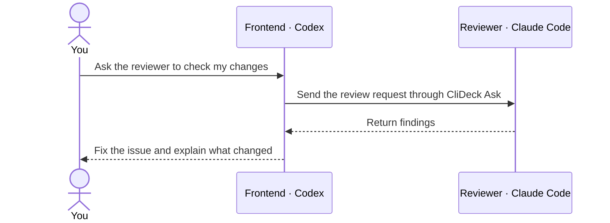

# clideck

One place for your AI agents to work with you and each other.


*Three projects, six sessions, and a Codex agent working with a Claude Code reviewer.*

Put a frontend agent, a backend agent, and a researcher in the same project. They can
use different AI providers. Tell one to ask another for help, and the request and
answer travel between their actual terminals. You stay part of the conversation.

CliDeck runs the agent CLIs you already use. No orchestration code to write, and no
new agent API to wire up.

## Quick start

Requires **Node.js 22.12 or newer** and at least one installed agent CLI.

```sh
npm install -g clideck@2
clideck
```

Open **http://127.0.0.1:4000**. Create a project, open a few sessions, and give them
names that describe their work. The short tour shows you around.

You can also run `npx clideck@2`. Coming from v1? Read [the upgrade notes](UPGRADING.md)
first. The latest v2 imports your legacy sessions, projects, and saved prompts automatically.

## Agents working together

Say “ask the reviewer to check my work.” Your agent discovers the reviewer, sends
the request, and gets the answer back. The reviewer can use a different provider.

You talk to your agent as usual. CliDeck handles the conversation between sessions:


```mermaid
sequenceDiagram
    actor You
    participant Frontend as Frontend · Codex
    participant Reviewer as Reviewer · Claude Code
    You->>Frontend: Ask the reviewer to check my changes
    Frontend->>Reviewer: Send the review request through CliDeck Ask
    Reviewer-->>Frontend: Return findings
    Frontend-->>You: Fix the issue and explain what changed
```


*In this example, Codex asked Claude Code to review the navigation. The reviewer
found a route-matching bug; Codex fixed it and passed all seven checks. Each agent
worked in its own terminal, and the reply came back to the agent that asked.*

- **Projects** keep sessions together around a folder.
- **Session names are addresses** such as `@website/reviewer`. Type `@@` in a
  terminal to find them.
- **CliDeck Ask** carries requests and replies between sessions. Agents can check
  who is available or steer a session that is already working.
- **You stay involved** through the terminals, notifications, and questions agents
  can send back to you.

The agent-facing commands are available inside CliDeck sessions:

```sh
clideck agents
clideck ask "@website/reviewer" "Review the changes and report the important issues"
clideck ask status
```

## View what they produce

Ask an agent to show its work inside CliDeck. Markdown reports, HTML pages, images,
videos, PDFs, diagrams, and diffs open in preview tabs beside the terminals. You can
also drop files onto the tab strip.


*The same review, summarized as a document you can read inside CliDeck.*

```sh
clideck show report.md
clideck show demo.html
clideck show walkthrough.mp4
```

## Also included

- Claude Code, Codex, Gemini, OpenCode, Pi, and shell sessions, plus custom commands.
- Saved prompts with `//` lookup and `{{session_name}}` / `{{project_name}}` fields.
- Session resume, terminal history, working/idle notifications, and session backups.
- Light and dark themes, configurable shortcuts, and a plugin SDK.
- **Git Changes** shows what your agents changed, with branch and worktree comparisons.
- **Supertonic Voice** reads replies and selected text aloud.
- **Emoji** support and optional **Smart Dictation** for speaking your prompts.

Voice models are downloaded when set up; they are not included in the npm package.
OmniVoice is not part of this release.

## What changed in v2

We removed Autopilot because today's agents already have sub-agents. The CLI is
the right interface for this generation of CLI agents, so CliDeck focuses on
helping them work across providers with you.

We also removed mobile control. Harnesses such as Codex and Claude Code now provide
their own remote access, and maintaining another mobile control layer no longer
makes sense for CliDeck.

The focus is projects where you and agents from multiple providers work together,
with their conversations and outputs in one place.

## Running locally

```sh
clideck --port 4200
clideck --data-dir /path/to/clideck-data
clideck --help
clideck --version
```

`CLIDECK_PORT` or `PORT` also sets the port. CliDeck v2 binds to loopback only. Its default
data directory is `~/.clideck-next`, kept separate from v1's `~/.clideck`.
Agent CLIs use their own accounts and network connections.

For development, run `npm ci`, `npm test`, then `npm start`.

## Docs

- [Upgrading from v1](UPGRADING.md)
- [Session backup and recovery](SESSION-BACKUP.md)
- [Plugin SDK](PLUGIN-SDK.md)

## License

[MIT](LICENSE)
